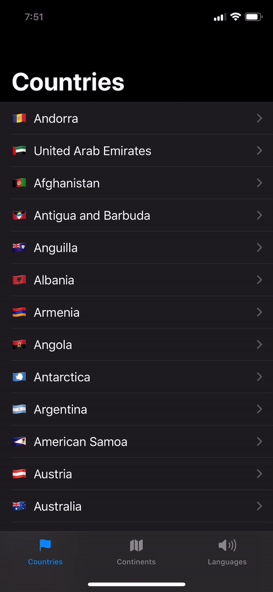

# Countries Example App

This is a Hello World example on how to use [Graphaello](https://github.com/nerdsupremacist/graphaello) in a Swift UI Project.
It's using the [Countries API](https://countries.trevorblades.com)

## How does it look?

Please try it for yourself. Navigate the code.

Here's a short screen recording of the App:

